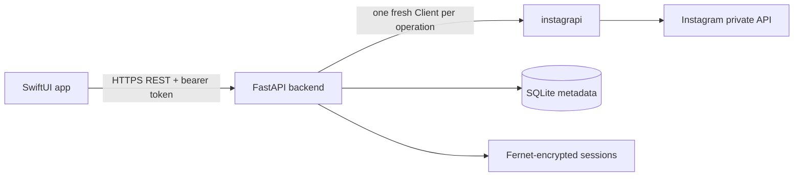

# Architecture

## System model

Lillygram is a fully native SwiftUI iOS client backed by a small private Python
service. The iOS app never loads Instagram web pages and never talks to
Instagram directly. The backend is the only component that imports
`instagrapi` or holds Instagram session state.

This removes the old `WKWebView`, JavaScript injection, DOM selector, response
splice, and cookie-observation layers. The product rules are now enforced on
stable native models at both the backend and client boundaries.

## iOS application

All source files live under `ios/Lillygram/`.

| File | Responsibility |
| --- | --- |
| `LillygramApp.swift` | App entry point. |
| `ContentView.swift` | Restores the app token and chooses launch, sign-in, verification, or native tab UI. |
| `Models.swift` | Codable REST contract models. |
| `APIClient.swift` | HTTPS requests, multipart uploads, ISO-8601 decoding, backend URL validation, and Keychain app-token storage. |
| `AppStore.swift` | Main-actor session and feature state; paginated feed, stories, messages, uploads, account state, and final content filtering. |
| `NativeViews.swift` | Native Home, Stories, Search, Messages, Profile, Settings, favorites picker, upload composers, and isolated Reel player. |
| `FavoritesStore.swift` | Per-account, `UserDefaults`-backed selected-account list. |
| `OnboardingView.swift` | Native bug reporter retained from the old app. |

The app token is stored with
`kSecAttrAccessibleAfterFirstUnlockThisDeviceOnly`. Instagram passwords are
held only in the active SwiftUI sign-in form and sent once to the configured
backend. They are not written to Keychain, `UserDefaults`, logs, or backend
storage.

The backend address is user-configurable. Production devices require HTTPS.
Plain HTTP is accepted only for `localhost` and `127.0.0.1` to support simulator
development.

## Backend

The backend package lives under `backend/`.

| Module | Responsibility |
| --- | --- |
| `config.py` | Environment-only configuration and conservative limits. |
| `models.py` | Versioned REST request/response models. |
| `storage.py` | SQLite account metadata, hashed app tokens, Fernet-encrypted session/proxy blobs, and durable request counters. |
| `instagram.py` | Narrow typed adapter around `instagrapi`; private response conversion and Reel exclusion. |
| `service.py` | Per-account locks, login/session lifecycle, pacing, hard limits, warm-up, and account-local challenge freezing. |
| `main.py` | FastAPI routes, bearer authentication, upload validation, and error envelopes. |

`Dockerfile` runs the service as an unprivileged user. The database and
`LILLYGRAM_ENCRYPTION_KEY` must be persisted independently. Losing the key makes
stored sessions intentionally unreadable.

## Authentication and session lifecycle

1. The user configures an HTTPS backend and enters Instagram credentials.
2. The backend creates an account record if needed. A fresh `instagrapi.Client`
   generates its device settings and UUIDs once, before the first login attempt.
3. Those settings are encrypted immediately. Every later login or API request
   reloads that same device identity.
4. A successful login updates the encrypted session and returns a random app
   bearer token. Only the SHA-256 digest of that token is stored server-side.
5. The iOS app stores the bearer token in Keychain and restores `/v1/session`
   on launch. It never silently submits Instagram credentials again.
6. `ChallengeRequired`, two-factor-required, `LoginRequired`, rate blocks, and
   related trust failures freeze only that account. The client presents the
   explicit verification or reconnect state.
7. Two-factor accounts store Instagram's authenticator setup key once, encrypted
   at rest. Every later login derives the current code locally with
   `totp_generate_code`, so no SMS delivery or device-approval prompt is
   involved. Passwords and derived codes are never persisted.

SMS request and device-approval endpoints were removed in 0.7.0. SMS was never
delivered for the test account, and re-running a password login cannot complete
an approval: each login POST creates a new, unapproved challenge.

A fresh `instagrapi.Client` is constructed from one account's encrypted settings
inside that account's `asyncio.Lock` for every operation. No live client,
cookie jar, device settings object, proxy, or retry state is shared between
accounts.

## Safety controls

- Read and write counters are durable per account in SQLite.
- Default ceilings are 120 reads, 6 writes, and 3 login attempts per rolling
  hour. Operators can lower them with environment variables.
- Reads wait a random 0.8 to 2.5 seconds; writes and logins wait a random 2 to 6
  seconds before the upstream request.
- SMS request and verification both consume the durable login-attempt budget.
  There are no automatic sends, resends, polling loops, or code retrieval.
- New accounts are read-only for three days by default.
- Feed, profile media, and messages are fetched one page at a time and only when
  their native surface is opened.
- Posting and story upload are single, user-initiated operations. No batch or
  scheduled write endpoint exists.
- DMs are read-only in Lillygram. Replying explicitly hands off to Instagram.
- Proxy configuration is stored encrypted per account and reapplied to every
  fresh client. Proxy provisioning is outside this repository.

These controls reduce unnecessary automation. They cannot guarantee that Meta
will accept unofficial API traffic or that an account will never be challenged.

## Product enforcement

### Favorites-only Home

The backend returns a timeline page with Reels removed. `AppStore` then filters
that page to the exact usernames selected for the current account. It preserves
Instagram's page order and never inserts an algorithmic fallback. Empty
selection means empty Home.

### Stories and posts

Story trays load only when Stories opens. Photo/video story and feed uploads are
explicit multipart requests and share the per-account write cap and warm-up.
Creating Reels is not exposed.

### Search and profiles

The only search route is `/v1/search/accounts`. There are no media, hashtag,
place, Explore, or Reel-search endpoints. Profile pages fetch profile metadata
and paginated non-Reel media.

### DMs and shared Reels

Threads and messages are fetched read-only. A media item is allowed into
`SharedReelPlayer` only when the backend marks it as a Reel extracted from a DM
share. The player contains one `AVPlayer`, a Done action, and no next item,
recommendation, autoplay chain, or Reel navigation surface.

## REST surface

- `POST /v1/auth/login`
- `PUT /v1/auth/totp-seed`
- `GET /v1/session`
- `GET /v1/settings`
- `PUT /v1/settings/proxy`
- `GET /v1/feed?cursor=`
- `GET /v1/stories`
- `POST /v1/stories`
- `POST /v1/posts`
- `GET /v1/search/accounts?q=`
- `GET /v1/profiles/{username}`
- `GET /v1/profiles/{username}/media?cursor=`
- `GET /v1/direct/threads`
- `GET /v1/direct/threads/{id}/messages`
- `GET /v1/media/{id}?shared_reel=true`

There is deliberately no DM-send, bulk action, auto-reply, batch upload, or Reel
feed endpoint.
